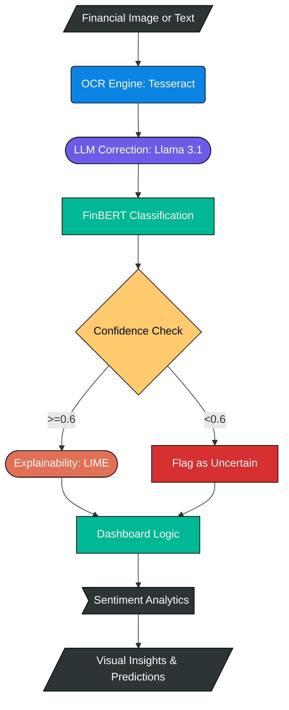
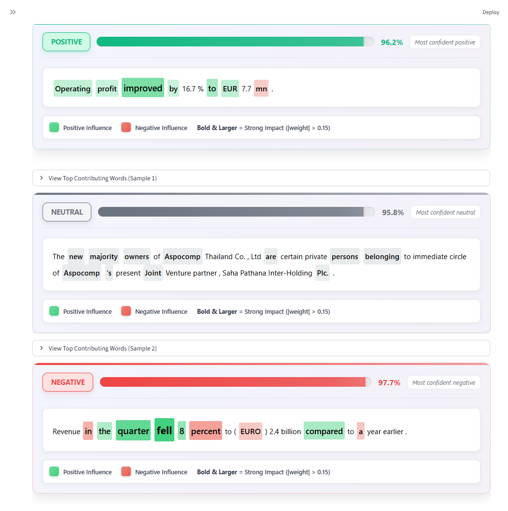
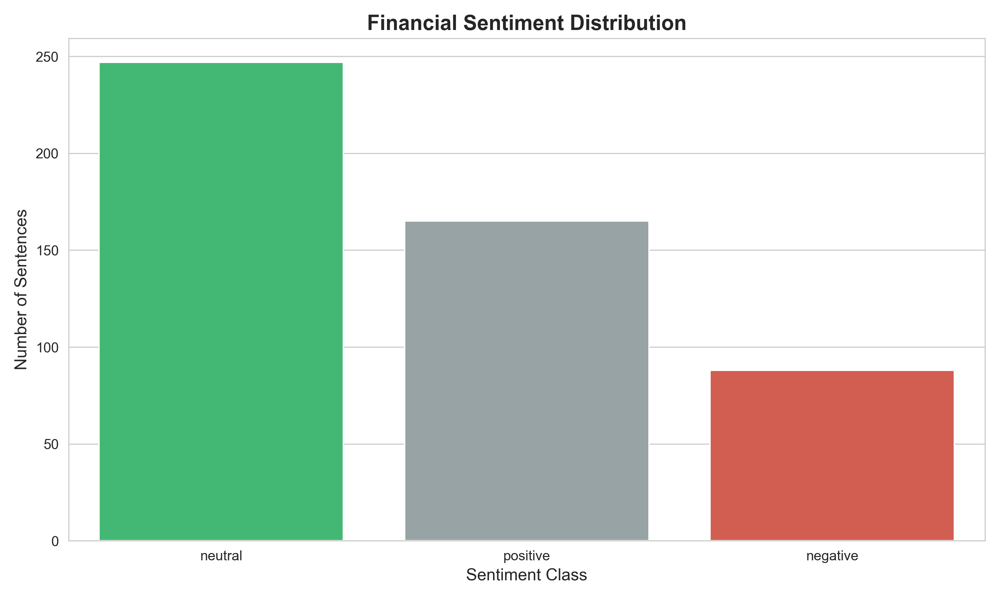
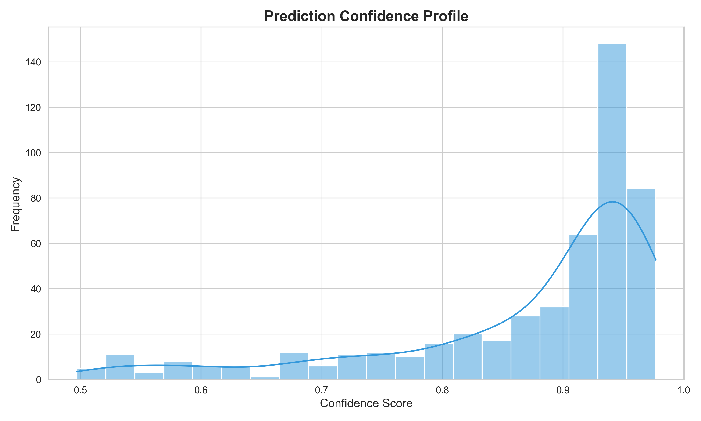
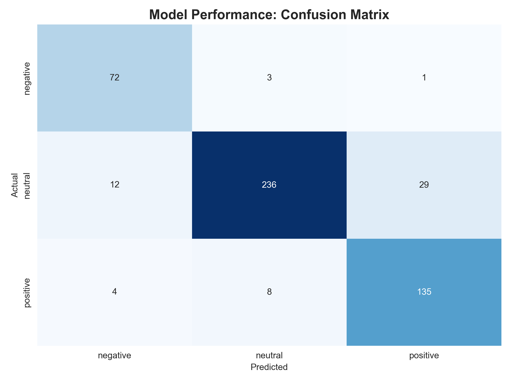

# Financial Sentiment Analysis Dashboard

[](https://opensource.org/licenses/MIT)
[](https://www.python.org/)
[]()

A high-fidelity sentiment analysis pipeline designed for financial text. This system integrates Optical Character Recognition (OCR), Large Language Models (LLMs) for text structuring, and specialized financial transformers (FinBERT) to provide actionable insights with local explainability (LIME).

## System Architecture



## Key Features
- **OCR-to-Insights**: Extract text from financial reports or screenshots using Pytesseract.
- **LLM-Enhanced Refinement**: Automatic correction of OCR artifacts and sentence segmentation using Llama 3.1.
- **Financial Sentiment Engine**: Domain-specific classification using the ProsusAI/finbert transformer.
- **Model Explainability**: Word-level contribution analysis via LIME to demystify "black-box" predictions.


*Figure 1: Sentiment analysis results showing confidence scores and LIME-based word contributions for each classification.*


## Getting Started

### Prerequisites
- Python 3.9+
- Tesseract OCR Engine installed on your system

### Installation
1. Clone the repository:
   ```bash
   git clone https://github.com/aniketqxp/financial-sentiment-analysis.git
   cd financial-sentiment-analysis
   ```

2. Create and activate a virtual environment:
   ```bash
   python -m venv .venv
   source .venv/bin/activate  # On Windows: .venv\Scripts\activate
   ```

3. Install dependencies:
   ```bash
   pip install -e .
   ```

4. Configure environment variables:
   Create a `.env` file in the root directory:
   ```env
   HUGGINGFACE_API_TOKEN=your_token_here
   GEMINI_API_KEY=your_key_here
   ```

## Quick Start

To launch the interactive dashboard:
```bash
streamlit run app.py
```

### Pre-generating Analysis Materials
For large datasets, use the utility script to pre-compute visualizations:
```bash
python scripts/generate_materials.py
```

## Visualizations





## License
Distributed under the MIT License. See `LICENSE` for more information.
